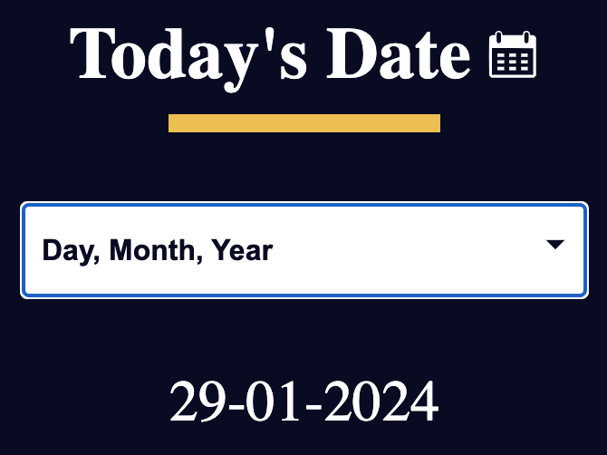
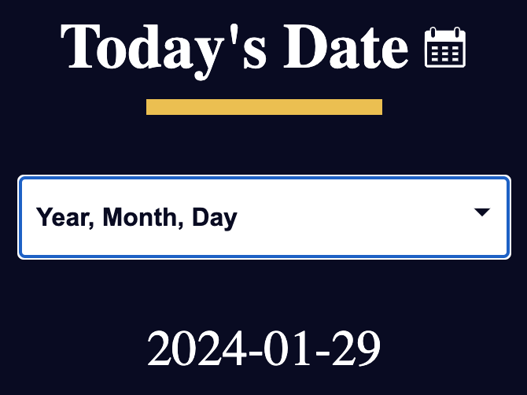
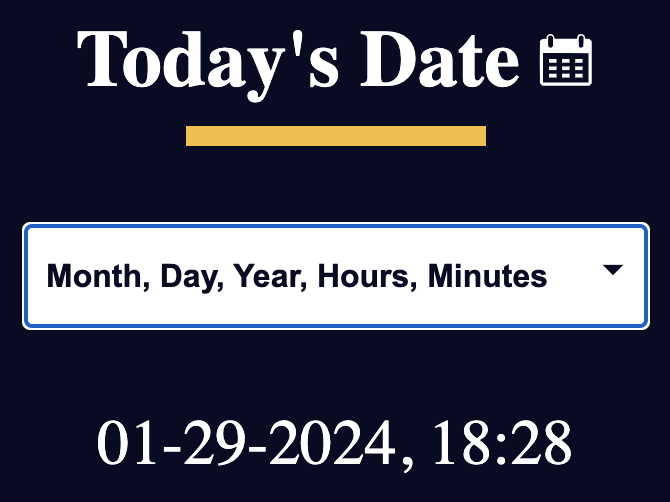

#  Date Object by Building a Date Formatter

This project focuses on utilizing the JavaScript Date object to build a simple Date Formatter web application.

## Introduction

The **Date Formatter** project demonstrates the application of the JavaScript Date object to retrieve and format the current date based on user preferences. The formatted date is displayed in different formats, allowing users to explore and understand the Date object.

## Usage

The application, upon opening, displays the current date in the default format (dd-mm-yyyy). Users can choose different date formatting options from the dropdown menu.

## Date Formatting Options
The application supports the following date formatting options:

- Day, Month, Year (dd-mm-yyyy): Default format.
- Year, Month, Day (yyyy-mm-dd): Reversed order.
- Month, Day, Year, Hours, Minutes (mm-dd-yyyy-h-mm): Includes hours and minutes.

To change the date format, select an option from the dropdown menu, and the displayed date will update accordingly.

## Getting Started

To run the project locally, follow these steps:

1. Clone the repository: `https://github.com/jaganpofficial/Date-formatter.git`
2. Open index.html in your preferred web browser.
3. Begin to learn about the Date object!
   
